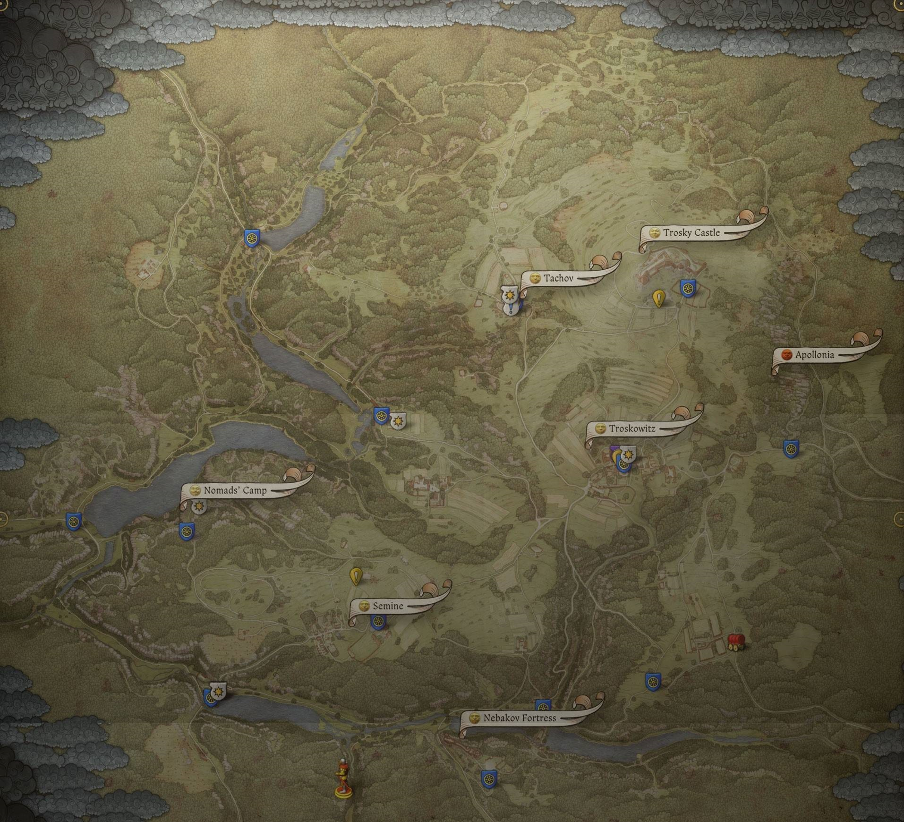
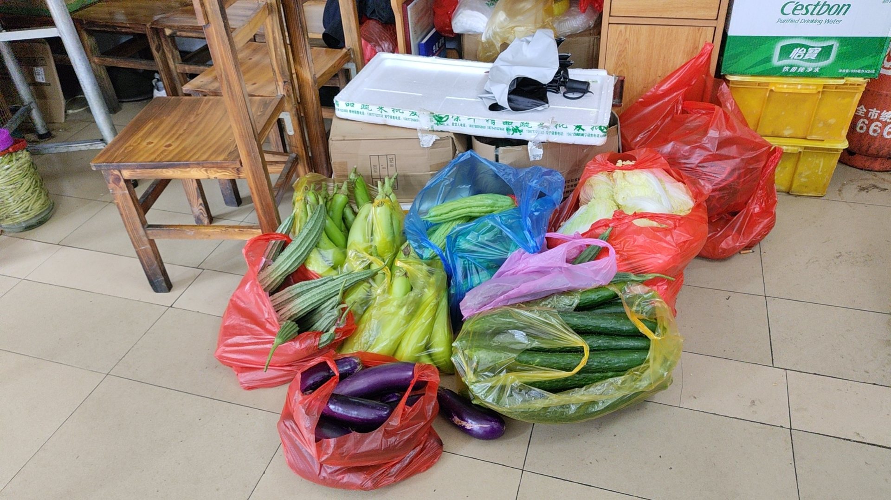

# 三下乡
三下乡的经历我永远难忘，但是如果我把我的真实感受公布在网络上，这份文档可能会被无形的大手给抹去

## 注意
- 三下乡不是免费**旅游**
- 如果你吃不了苦，需要足够的睡眠时间，那就不要报名三下乡，把这部分时间花在尽情地玩乐上会更有价值
- 如果你是提前去的，那么学会和老乡打交道很重要
- 如果你是技术组的核心成员，不要指望三下乡会给你带来很多快乐，干活才是你的首要任务
- 自备生活用品可以让你的三下乡生活更加舒适一点
- 如果你想台上三分钟，却**深藏功与名**

## 个人感受（部分）
跟缺乏娱乐和无所事事地待在家里相比，三下乡的生活还是很有意义的。三下乡究竟给我带来了哪些技术方面的进步，我不好说，但是可以肯定的是，我的而且确通过三下乡拓宽了自己的眼界，也丰富了日常生活的经验。

### 从游戏到现实
大二寒假以来我一直都沉迷在天国拯救，一代打完没多久，看到epic商城有折扣，就忍不住买了二代。原本我对天国拯救里面的地图界面没有什么特别的感受，直到我真正去到清远连州的东陂镇，在大疆司空2的里，我看到了和游戏地图非常类似的卫星地图。乡镇和村子在地图上星罗棋布，跟天国拯救相比，连州的地图上还有许多大大小小的山。我可以给无人机划定好航线，在不同的地方拍下照片，恍惚间有种快速旅行的感觉。那些在车上感觉很远的地方，在地图上看起来却很近。

### Audentes Fortuna Iuvat（幸运眷顾勇者）
我和一位同学和一位师兄是跟着老师提前去的连州，这几天里我们得自行解决吃饭问题。第一天的晚饭，我和两位同学一起去到了楼下的饭店。我们当时想吃便宜点的，看见里面的桌子不是很大，就以为这是一家快餐店。

如果没有但是，那就太不符合我的文字风格了。

我们拿过菜单一看，大家都倒吸一口凉气，菜单上面每个菜都是硬菜，就连最简单的紫菜蛋花汤也得几十块钱。那时候大家的脸皮都比较薄，不好意思换一家店，便硬着头皮点了一个硬菜和两个简单的菜。到最后吃完，还剩下非常多的紫菜蛋花汤，感觉好像吃饱了，好像又没有吃饱。

最后面结账的时候，老板问我们是不是三下乡的，我说是，然后她给我们优惠了十几块钱来抹了个零。

走出饭店，师兄说：“这么吃下去可遭不住呀。” 我们三个人都这么觉得。所以，第二天午饭时分，我们三人就在东陂镇搜索起快餐店来。那一天的太阳非常猛烈，我们都没有带伞，强烈的高温让我的食欲瞬间降到冰点。搜索的路途从北到南，连续经过好几家“早餐店”为招牌的餐饮店，没有桌椅的烧腊专卖店和连州特色水角店之后，我们捕捉到了一家招牌上写着“快餐”两个字的饭店。

我们怀揣着激动的心推开了这家店的玻璃门，看到里面坐着刚刚摘下安全帽的在大声聊天的工人大叔，我顿时感觉稳了，肯定可以吃上便宜一点的饭菜了。

老板一家子都在厨房里忙活，我向老板打招呼，但是没有得到回应。我们还没打算坐下，因为桌子上没有看见菜单，刚刚还“稳了”的心突然又悬了起来。我发现厨房窗户旁边的桌子上有菜单，于是拿起一张来看。

太可惜了，菜单上几乎又全是最低三十多块的菜。

我已经不想再在太阳底下走动了，于是鼓起勇气，问老板有没有快餐卖。老板很自然地跟我们说有快餐，只是没写在菜单上而已，还有就是快餐的搭配非常灵活，一般来说都是厨房有什么就可以做什么，所以口头点菜会更加方便。

我们点了三个菜，没过多久，老板就把菜端上来了。

我敢说，这是我吃过的最美味的快餐。

没有任何的预制菜，只有最纯粹的厨艺和能够极大激发人食欲的锅气。朴实无华的菜品搭配经过老板高超技艺的烹饪，迎来了至高的升华。而且这些快餐都是统一15块钱一份，分量非常充足，并且米饭免费，性价比非常高。

从此，我们就几乎都在这一家店吃饭。

有一天在这里吃饭的时候，我看到厨房外面摆满了蔬菜，我问老板那一天是什么日子。老板说是赶集日，每五天一次。在很小的时候，我经常听大人说“吵天巴闭，趁圩啊？（粤西白话，在珠三角可能读作‘嘈喧巴闭’，意思为吵吵嚷嚷，闹哄哄）”，我在县城长大，从来没见过乡镇的赶集。前面几天东陂镇的白天的街道是不怎么热闹的，恰好遇到赶集日，又恰好我问了老板，我才终于知道什么是赶集，或者说“趁圩”。

回到这部分的小标题——Audentes Fortuna Iuvat（幸运眷顾勇者），我想说的是，无论遇到什么事情，都要勇敢开口去问和提出要求。以前的我总会感到“不好意思去做某些事情”，然而实际上，把自己的想法和需求说出来并不丢人，勇敢拒绝也不丢人。以前的我确实是因为各种各样的“不好意思”，吃了很多本来可以避免的亏，错失了很多机会。当你点了一份“蛋肉炒粉”而上来的是一份“蛋炒粉”的时候，跟老板指出缺少的肉，正常的老板会觉得是自己粗心大意犯了错，然后把炒粉拿回厨房重炒，而不正常的老板才会无理取闹，责怪你没有讲清楚要求。

在深圳这个发达的大城市里，相当大一部分的餐馆都支持扫码点餐，这对于i人来说是一项及其伟大的发明。而在像东陂镇这些扫码点餐尚未普及的地方，和老板打交道是下馆子的一项必备技能。这里不讨论扫码点餐的利弊。我想说的是，这种必须人与人面对面交流的环境，确实能让人学到很多东西：了解当地的风土人情，学会赞美和评价，学会询问和提出要求……