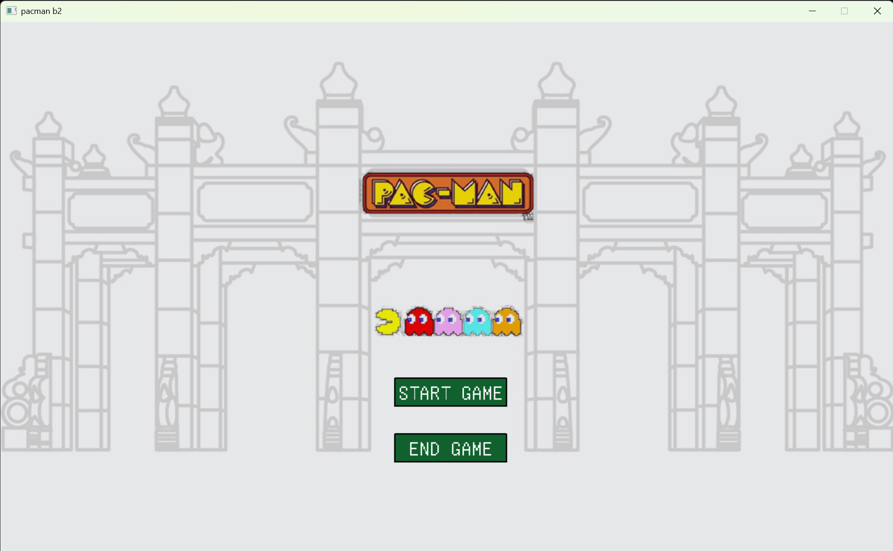
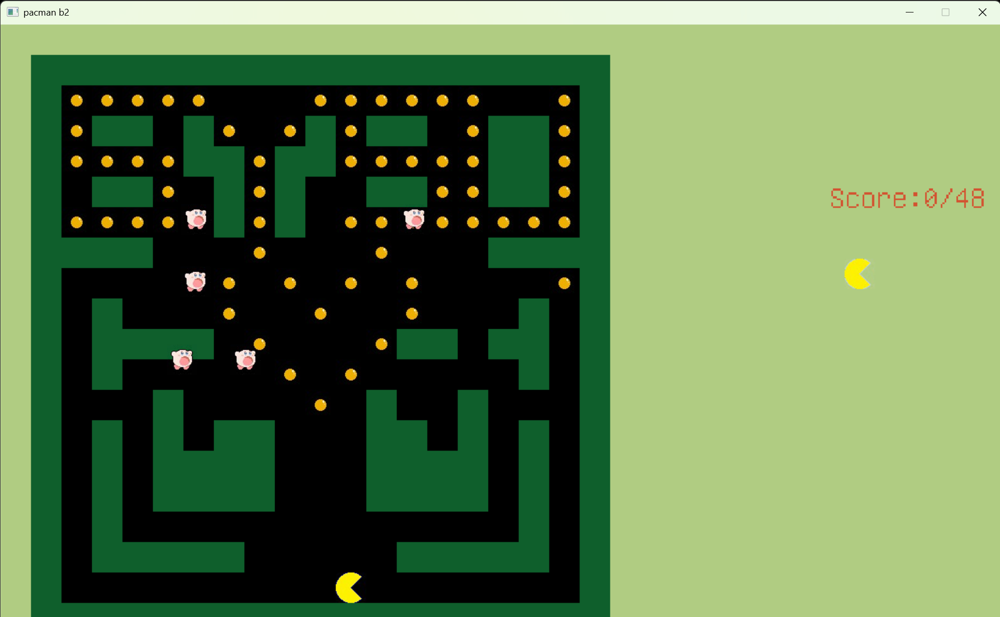

# 程序设计（C语言）
## 适用于任何涉及到程序设计的课程的注意事项
1. 不要让你的舍友来给你debug，没有人有会是你的私家侦探 🪲
2. 如果你的代码风格很糟糕，请不要强迫别人看你的代码，伤害别人的眼睛 👀
3. 如果你一点注释都不写，那么不要把你的代码文件发给你的舍友，让舍友猜你在想什么 🤔
4. 如果你已经理解自己的代码错在哪里了，那就自己知道就好，不要强行把那正在认真敲代码的舍友打断然后讲解你自己的反思 🤐
5. 不要好为人师，有的人享受独立思考和独立解决问题的过程，如果别人没有明确的请求，不要“伸出援手” 😑

## 个人经验
这门课对于那些高中就有算法竞赛经历的同学来说是小菜一碟，如果你像我一样是零基础的，只要紧跟老师上课的内容，课后作业好好做，大作业不摆烂，就能够保证你不会挂科。

23年期末考试考的是手写卷子，那时考了个手写冒泡法排序英语单词，没有上机考试，不知道以后会不会改变考核形式。

在网上有很多人推荐浙江大学翁恺老师的C语言课程，我在大一寒假的时候有看过一部分的课，主要是学习链表（Linked list），航院的C语言课不涉及链表，如果你希望精进C语言的话那我的确会建议你看一看。

学完C语言后再去学其他编程语言是很快就能上手的，我在学[CS61A](https://cs61a.org/)的时候很庆幸自己学过了C语言，大二后会有很多课程涉及到MATLAB，因此**C语言一定要好好学**。

大二上的数值计算方法课的实验课的编程语言也是C语言。

大二下的科创课（无人机方向）可能会涉及到C++和Ubuntu（一种Linux系统）以及[ROS](http://dev.ros2.fishros.com/)（ROS是用于构建机器人应用的软件库和工具集），还有GNU make，cmake等工具（复现别人论文成果会用到），这种情况下只会C语言就不够用了。哦对了，这些知识老师都不教的，你得自学。

如果你的目的只是通过考试的话，对于一些高深的知识，比如说GNU make，cmake还有wsl2和Linux，都是没有必要在学期中去学的（知乎经常给我推送批判中国大学的计算机教育非常不合理的内容，但我个人觉得这些内容很容易误导非计算机专业的学生），毕竟考试不考，而且你还得学其他科目。大作业会要求把代码打包成可执行文件，因为指定的IDE是Visual Studio，可以直接上网搜索如何利用Visual Studio生成可执行文件。

合理使用AI工具，比如Deepseek，尤其是[Cursor](https://cursor.com/cn)可以了解一下。

如果你学完C语言后意犹未尽，想继续踏上CS自学之旅，那么不妨前往[CS自学指南](https://csdiy.wiki/)。

## 个人感悟
大一的C语言程序设计基础课算是我真正的梦开始的地方。

初中的时候，我接触过Python，为了学习我在网上找了一大堆封面看起来很酷炫的电子书。由于没有明确的学习方向，我坚持学了一段时间，但收获甚少，最终只是能够把书上的例子抄在代码编辑器的程度。大一军训期间我尝试过在B站上找Python公开课来学习，不过忘记了是什么原因就没有坚持学下去。

因此，我相当于是从0开始学编程的。刚开始上理论课的时候我感觉到非常吃力，比方说老师写了一个`int max(int x, int y)`的函数，我可以看懂`max(1, 2)`是什么意思，但是如果写成 `max(2, max(10, 1))`，我就得思考半天，因为在我看来`max`的第二个位置明明必须是一个整形，怎么可以放一个“函数”呢？直到后来我对`return`有了一定的了解之后，我才明白这种写法的含义。

程序设计的实验课是我最喜欢的课，因为通过做[PTA](https://pintia.cn/home)（其实我很奇怪为什么航院的C语言实验课不用中大的matrix，反而用浙大的PTA）上面的编程题能够让我清楚地认识到自己都学会了哪些知识，我很享受不断去优化代码的过程，很享受为了解决各种各样的特殊条件而绞尽脑汁并且最后全部测试都通过的成就感。

### 大作业
最后的大作业则是让我真正踏上CS自学之路的最重要的因素。我的小组的大作业是一个吃豆人小游戏，整个项目，除了写报告之外，至少有99%的工作，包括素材搜集和代码编写，都是我一个人完成的。

刚开始做大作业的时候我的确知道有哪些功能是要做的，但是对于代码实现，我真的是一筹莫展，尤其是给ghost设计寻路算法这一环节。虽然我已经学完了C语言的基础知识，但是真正去进行“程序设计”，我真的是束手无策。

最开始我想到的办法是，去Github上找别人的项目，改几个变量名和参数作为自己的项目。

然而，那些项目涉及到的知识都远远超出课堂所包含知识的范围，如果老师或者助教突然问我某个功能是如何实现的，那我必然露出马脚。于是我放弃了剽窃他人成果这条路。小组里面没有编程大佬，并且大家都有各自的事情要做，而恰好我是对这方面最感兴趣的，只能说，靠天靠人不如靠自己。

幸好，我在B站上找到了关于easyX和C语言写吃豆人的教程视频，于是我就一边跟着视频教程，一边敲自己的代码。专心投入到大作业代码的编写的那几天是我学习热情最高涨，学习效率不断突破上限的几天，一看完视频我就能把相应的功能实现，我感觉自己就是某个单机游戏里面的主角，一路高歌猛进地推进主线，屏幕上方源源不断地跳出解锁成就的通知，持续推动我继续往下学。

在完成大作业的过程中，我学到了非常多课堂上老师没有讲清楚但是我一直很好奇的东西，比如C语言里面的`.h`头文件，`extern`外部变量，为什么需要自定义函数而不是把所有功能都只写在一个主函数里面，如何把写好的代码打包成`.exe`文件，等等。

最终，我完成了这个吃豆人小游戏。

比较可惜的是没有实现ghost（图片上的卡比）的寻路算法，因为我找到的跟寻路算法相关的教学视频都涉及到数据结构，我觉得学数据结构会花上不少的时间，大作业的提交迫在眉睫，我不得不放弃。

成绩出来后，我的C语言实验课（PTA作业和大作业综合得分）取得了一个相当不错的成绩，然而，我感觉我的成就感更多地是来源于——我靠着自学做完了这个小游戏。

大一的程序设计课结束之后，我踏上了CS自学之路。

