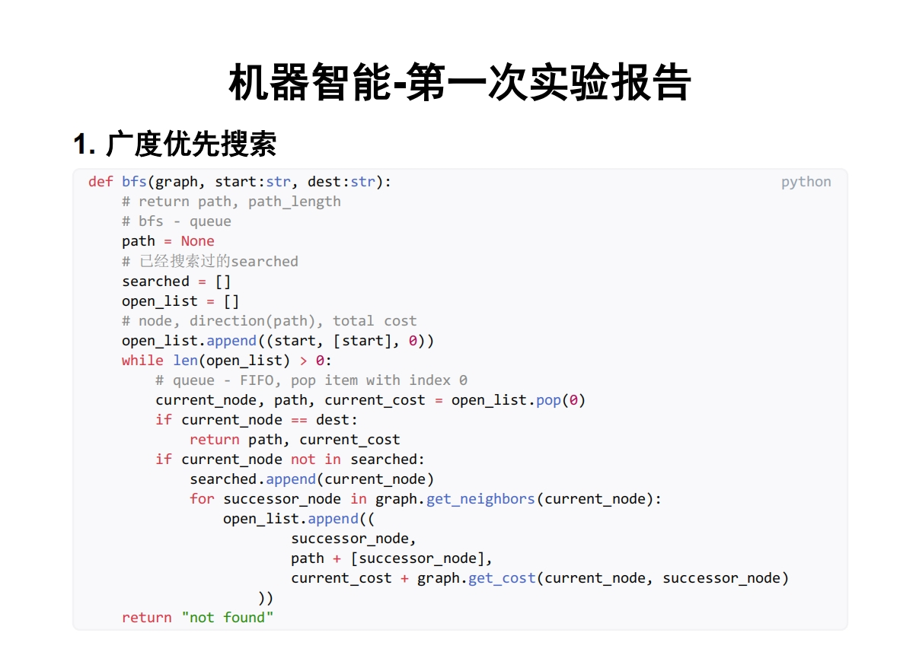

# 机器智能
## 课程简介
- **前置条件：** Python，anaconda配置虚拟环境，Jupyter Notebook，一点点数据结构的知识，一点点图论的知识
- **课程教材：** 基本上不会用到
- **课外拓展：** [CS188 Spring 2025](https://inst.eecs.berkeley.edu/~cs188/sp25/)
- **实验课必看：** [适用于任何涉及到程序设计的课程的注意事项](../Freshman/Programming%20Design.md)

## 个人经验
在大二下学期之前，如果你已经了解了Python的基本语法，比如说类和函数，列表推导式（list comprehension），等等，并且了解大多数关键字的意思，那么这门课上起来就没有那么痛苦。

如果你还学了一点点数据结构和图论，那么这门课会给你带来很多的快乐。

有很多同学在上了前面两节课之后就退课了，老师说往年也是这样的情况，你觉得这门课不适合自己，那就大胆地去写退课表吧。

我个人觉得，对于那些零基础的同学来说，前两节关于路径搜索的课程强度确实很大。很多同学都没接触过数据结构和算法这门课程，第一节实验课只是匆匆忙忙地过一遍Python的语法，然后就要动手去实现BFS和DFS。

我原本在大二的寒假就学完了[CS61A](https://cs61a.org/)的Python部分，再加上我在大二第二学期的前半学期的做科创课项目时已经学完了BFS，DFS和A*，我在刚开始的两节课就学得很轻松。

后面的粒子群优化（PSO）和蚁群算法（ACO）以及机器学习相关课程的压力就没有那么大了，越来越多同学都能够在实验课上就把作业做完。

机器智能的实验报告我是用[typst](https://typst.app/)来完成的，我根据[obsidius](https://typst.app/universe/package/obsidius)模版进行修改得到了我的实验报告模版，大概长这样

> 这上面的答案学习的是别人在CS188上project 1的做法 [链接](https://github.com/darstib/cs188/blob/main/project/project-1.md)

我个人用typst主要是因为我想练习typst，此外typst排版代码很方便，有语法高亮，而且不用担心下面放多几张图片然后上面的文字就开始上蹿下跳。

期末大作业不算特别难，学会利用AI工具真的非常重要。虽然说有了AI工具能省去很多麻烦的工作，但引导AI干活还是必须得有点知识储备。

有的同学可能不清楚解决问题应该要用什么算法，索性就让AI去猜，但AI猜出来的算法可能并不适合大作业，最后面就没做出来（或者做出来效果很差）。

这门课的名字叫做“机器智能”，在别的学院可能会叫做“人工智能导论”。老师是推荐学生使用AI工具来解决问题的，所以哪怕你真的编程能力非常有限，你也是有很多的方法来通过这门课程的。

## 个人感悟
我在前言里面说过我不会给出对课程的包含个人强烈情感色彩的评价，但是对于机器智能这门课，我不得不破个例。

这是我在航院上过的最开心，最有价值的课程，这门课让我感到两年前自己的高考分数是多么的值。

听胡老师讲课是一种美妙的享受。旁征博引，信手拈来，幽默风趣，生动形象，胡老师的课总是能够让我的注意力持续在线。

从人工智能的历史发展，到科研界和工业界的最新动态；从古代诗篇中的友情，到中大校训的挖掘和启发；从天空中飞掠的鸟群，到群体智能算法的实现……你在这门课上能够学到的远不止如何敲Python代码。