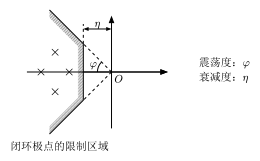

# 画图工具

高中时期，我一直对课本和试卷上的数学物理图像很好奇，很想知道那些看着简单，用尺子和量角器量出来的长度和角度在数值上和题目条件完全吻合的图片究竟是用什么画图工具做出来的。很可惜，高中的我并没有找到答案。

大学期间，各种各样实验报告和课后作业都要求画图，这让我了解到许多画图工具。

## draw.io
- **官方链接：** [draw.io](draw.io)

一个矢量绘图网站，可以用来绘制流程图。

Demo：下面是我做leetcode第19题“删除链表倒数第n个节点”的[笔记](https://github.com/yigebande/Notes-Of-Algorithm/blob/main/2025%E5%B9%B47%E6%9C%8826%E6%97%A5%20%E9%93%BE%E8%A1%A82/%E5%88%A0%E9%99%A4%E5%80%92%E6%95%B0%E7%AC%ACn%E4%B8%AA%E8%8A%82%E7%82%B9.md)，在draw.io画的图。

## TikZ(LaTeX)
- **官网链接：** [https://tikz.dev/](https://tikz.dev/)

TikZ我个人用的比较少，但是可以确定的是TikZ是一个功能非常强大的代码矢量绘图软件。

## CeTZ(typst)
- **官网链接：** [https://cetz-package.github.io/](https://cetz-package.github.io/)
- 在typst编辑器中使用

这是一个功能非常强大的代码矢量绘图软件。

我是从[链接](https://github.com/typst/typst/issues/2120)里面知道可以把`.typ`文件编译成`.svg`文件的。

这个是我使用CeTZ照着老师的课件上的图片重新画的图。

### TikZ和CeTZ的区别
- [https://diagrams.janosh.dev/](https://diagrams.janosh.dev/)

上面这个网站包含很多用TiKZ和CeTZ来绘制的图像。很多图像的TiKZ代码比CeTZ的简洁很多，我个人认为是TiKZ更加强大一点。

## Mathematica, MATLAB, Python, GeoGebra
详见[数学工具](../Math%20Tools/Tools For Mathematics.md)

一般来说，我都是让AI给我生成MATLAB和Python的绘图代码的，因为我没有认真学过这两个的绘图功能，而且真正要用到MATLAB和Python来进行绘图的时候都是要绘制很多而且很复杂的图片，与其自己琢磨一整天，不如直接让AI出手。

## Visio
- **相关链接：** [如何安装激活 Visio 和 Project 专业增强版？](https://ms.sysu.edu.cn/visio-project)

我没用过，不过上网搜索“画图软件”，大多数结果都会有Visio。

## CAD
说实话CAD在工程制图或者机械设计实验课之外就几乎用不上。在数学建模比赛里面的一些工程类的问题可能用得上。